# Verticals Dependency DAG

**Status:** M8 Planning
**Author:** Replit Agent (M8 Planning)
**Date:** 2026-04-09

---

## Platform Layer Dependencies

All verticals depend on the M1–M7 shared platform layer. The DAG below shows:
- Shared infrastructure (boxes at top)
- Vertical categories (middle)
- Individual verticals (bottom)

```mermaid
graph TD
    %% ─── SHARED PLATFORM CORE (M1-M7) ───
    GEO["📍 packages/geography\n8-level hierarchy\nFacility Places"]
    POL["🏛️ packages/core/politics\noffices, jurisdictions\nassignments, terms"]
    AUTH["🔐 packages/auth\nJWT + tenant guards\nKYC tier enforcement"]
    ENT["⚙️ packages/entitlements\nsubscription + layers\nrequireKYCTier()"]
    COMM["👥 packages/community\nspaces + channels\ncourses + events (M7c)"]
    SOC["📲 packages/social\nprofiles + posts\ngroups + DMs (M7d)"]
    PAY["💳 packages/payments\nPaystack checkout\nwebhook verify"]
    ID["🪪 packages/identity\nBVN/NIN/CAC/FRSC\nPrembly API"]
    OTP["📱 packages/otp\nSMS/WA/TG/Email\nTermii + 360dialog"]
    POS_INFRA["🏧 packages/pos\nfloat-ledger\nagent terminals"]
    EVENTS["📡 packages/events\npublishEvent\nprojections"]
    VTX_PKG["🏗️ packages/verticals\nFSM engine\nrouter + entitlements matrix\n(M8a — NEW)"]

    %% ─── PLATFORM → VERTICALS INFRA ───
    GEO --> VTX_PKG
    POL --> VTX_PKG
    AUTH --> VTX_PKG
    ENT --> VTX_PKG
    COMM --> VTX_PKG
    SOC --> VTX_PKG
    PAY --> VTX_PKG
    ID --> VTX_PKG
    OTP --> VTX_PKG
    EVENTS --> VTX_PKG

    %% ─── M8b: POLITICS + POS BUSINESS ───
    subgraph M8b["M8b — Original Focus (Days 1-5)"]
        POLITICIAN["👤 Individual Politician\nP1-Original\npolitics tables\ncommunity + social"]
        PARTY["🎗️ Political Party\nP1-Original\norganization subtype\nparty affiliation"]
        CAMPAIGN["🗳️ Campaign Office\nP3\nvolunteer management\nward coverage"]
        LGA_OFFICE["🏠 LGA / Ward Office\nP3\nservice directory\npublic notices"]
        POS_BIZ["🖥️ POS Business Mgmt\nP1-Original\nNOT agent fintech\ninventory + CRM + scheduling"]
    end

    VTX_PKG --> POLITICIAN
    VTX_PKG --> PARTY
    VTX_PKG --> CAMPAIGN
    VTX_PKG --> LGA_OFFICE
    VTX_PKG --> POS_BIZ
    POL --> POLITICIAN
    POL --> PARTY
    POL --> CAMPAIGN
    POL --> LGA_OFFICE
    COMM --> POLITICIAN
    SOC --> POLITICIAN
    SOC --> PARTY

    %% ─── M8c: TRANSPORT ───
    subgraph M8c["M8c — Transport Verticals (Days 6-10)"]
        MOTOR_PARK["🚌 Motor Park\nP1-Original\nFRSC + geography\nNURTW context"]
        TRANSIT["🚎 Mass Transit\nP1-Original\nroute licensing\nFRSC fleet"]
        RIDESHARE["🚗 Carpooling / Rideshare\nP1-Original\nofferings.route\ndriver KYC"]
        HAULAGE["🚚 Haulage / Logistics\nP1-Original\nFRSC + CAC\nfreight routes"]
        NURTW["🪧 NURTW / Transport Union\nP3\nmember mgmt\nlevy collection"]
        OKADA["🛵 Okada / Keke Co-op\nP3\nFRSC compliance\nearnings tracking"]
    end

    VTX_PKG --> MOTOR_PARK
    VTX_PKG --> TRANSIT
    VTX_PKG --> RIDESHARE
    VTX_PKG --> HAULAGE
    VTX_PKG --> NURTW
    VTX_PKG --> OKADA
    ID --> MOTOR_PARK
    ID --> TRANSIT
    ID --> RIDESHARE
    ID --> HAULAGE
    GEO --> MOTOR_PARK
    POS_INFRA --> MOTOR_PARK

    %% ─── M8d: CIVIC ───
    subgraph M8d["M8d — Civic Expansion (Days 11-15)"]
        CHURCH["⛪ Church / Faith Community\nP1-Original\nIT-XXXXXXXX\ncommunity_spaces"]
        MOSQUE["🕌 Mosque / Islamic Centre\nP3\nIT registration\nzakat management"]
        NGO["🌍 NGO / Non-Profit\nP1-Original\nIT-XXXXXXXX\nmembership tiers"]
        COOP["🤝 Cooperative Society\nP1-Original\nCAC verified\nsavings cycles"]
        YOUTH["🎓 Youth Organization\nP3\nIT registration\nmember elections"]
        WOMENS["👩 Women's Association\nP3\nmembership\nsavings groups"]
    end

    VTX_PKG --> CHURCH
    VTX_PKG --> MOSQUE
    VTX_PKG --> NGO
    VTX_PKG --> COOP
    VTX_PKG --> YOUTH
    VTX_PKG --> WOMENS
    COMM --> CHURCH
    COMM --> MOSQUE
    COMM --> NGO
    COMM --> COOP
    COMM --> YOUTH
    ID --> CHURCH
    ID --> NGO
    ID --> COOP
    PAY --> COOP
    PAY --> NGO

    %% ─── M8e: P1 COMMERCE + CREATOR ───
    subgraph M8e["M8e — P1 Commerce + Creator (Days 16-20)"]
        MARKET["🏪 Market / Trading Hub\nP1-Original\nmulti-vendor\ngeography Facility"]
        PROFESSIONAL["👔 Professional\nP1-Original\nlicense bodies\nappointment booking"]
        SCHOOL["🏫 School / Educational Inst\nP1-Original\nCAC + community_courses\nenrollment"]
        CLINIC["🏥 Clinic / Healthcare\nP1-Original\nCAC + license\nappointment scheduling"]
        CREATOR["🎬 Creator / Influencer\nP1-Original\nsocial + community\nmonetization"]
        SOLE_TRADER["🔧 Sole Trader / Artisan\nP1-Original\nWhatsApp catalogue\ninformal economy"]
        HUB["💡 Tech Hub\nP1-Original\ngeography + community\nstartup residence"]
    end

    VTX_PKG --> MARKET
    VTX_PKG --> PROFESSIONAL
    VTX_PKG --> SCHOOL
    VTX_PKG --> CLINIC
    VTX_PKG --> CREATOR
    VTX_PKG --> SOLE_TRADER
    VTX_PKG --> HUB
    GEO --> MARKET
    COMM --> SCHOOL
    COMM --> CREATOR
    COMM --> HUB
    SOC --> CREATOR
    SOC --> SOLE_TRADER
    PAY --> CREATOR
    PAY --> SCHOOL

    %% ─── M9+: P2 TOP10 COMMERCE ───
    subgraph M9plus["M9+ — Top10 Commerce + P2/P3 (post-M8)"]
        RESTAURANT["🍽️ Restaurant / Eatery"]
        HOTEL["🏨 Hotel / Shortlet"]
        PHARMACY["💊 Pharmacy"]
        GROCERY["🛒 Supermarket / Grocery"]
        LOGISTICS["📦 Logistics / Delivery"]
        FARM["🌾 Farm / Agricultural"]
        MORE["... 130+ more verticals\nP2 + P3 parallel"]
    end

    VTX_PKG --> RESTAURANT
    VTX_PKG --> HOTEL
    VTX_PKG --> PHARMACY
    VTX_PKG --> GROCERY
    VTX_PKG --> LOGISTICS
    VTX_PKG --> FARM
    VTX_PKG --> MORE
```

---

## Key Dependency Rules

### Rule 1 — Platform before verticals
`packages/verticals` (M8a) must be complete before **any** vertical implementation begins.

### Rule 2 — Original verticals before commerce expansion
All 17 P1-Original verticals must ship before P2 Top10 Commerce begins (M9).

### Rule 3 — Transport requires FRSC
All 4 transport verticals (Motor Park, Transit, Rideshare, Haulage) require `packages/identity/frsc.ts` — already implemented in M7a.

### Rule 4 — Route licensing is a transport prerequisite
`packages/verticals-motor-park` and `packages/verticals-transit` require route licensing fields — not yet implemented (deferred from M6c). Must be added in M8c.

### Rule 5 — Civic verticals require community_spaces
Church, Mosque, NGO, Cooperative, Youth Org all require M7c community platform — already complete.

### Rule 6 — CAC/IT verification is prerequisite for regulated verticals
All business/nonprofit verticals require `packages/identity` CAC/IT verification — already implemented in M7a.

### Rule 7 — Politics tables must be implemented before M8b
`packages/core/politics` currently has only `.gitkeep`. Implementation is M8b Day 1 prerequisite.

---

## Cross-Vertical Shared Packages (Used by 10+ Verticals)

| Package | Used By | Function |
|---|---|---|
| `packages/verticals` | All 160 | FSM engine, router, entitlements matrix |
| `packages/geography` | All place-based | Geography hierarchy + discovery |
| `packages/auth` | All | JWT + KYC tier guards |
| `packages/entitlements` | All | Subscription gating |
| `packages/payments` | 80+ | Paystack checkout + dues |
| `packages/identity` | 60+ | CAC/FRSC/IT/BVN/NIN |
| `packages/community` | 25+ | Community spaces + courses |
| `packages/social` | 15+ | Social profiles + posts |
| `packages/otp` | All | Verification codes |
| `packages/events` | All | Event bus projections |

---

*Generated: 2026-04-09 — `docs/governance/verticals-master-plan.md`*
